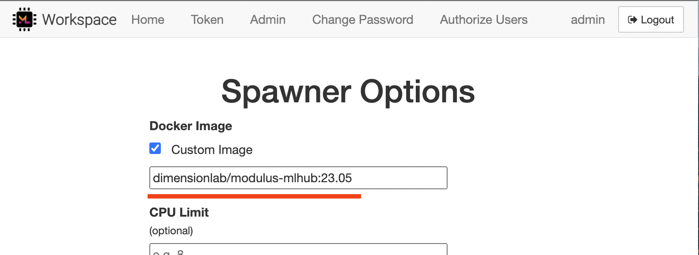

# modulus-mlhub

Hack to make Modulus containers run with DockerSpawner (or projects like [ML Hub](https://github.com/ml-tooling/ml-hub)).

Motivation: Modulus' container has `CMD` set to `null` istead of empty list `[]`, therefore starting it through ML Hub [crashes DockerSpawner](https://github.com/jupyterhub/jupyterhub/issues/3805).

### Building the Dockerfile

```
docker build -t dimensionlab/modulus-mlhub:23.05 -f Dockerfile .
```

### Using the container

Put a custom Docker image into the Spawner Options in ML Hub:

